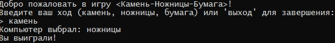
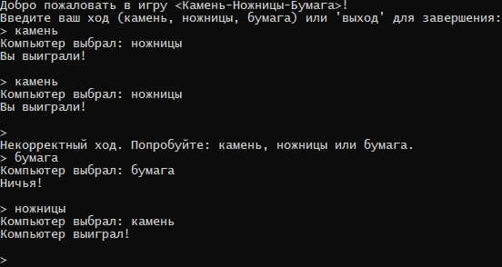

# Камень-Ножницы-Бумага

Консольная игра «Камень-Ножницы-Бумага» на C#. Игрок соревнуется с компьютером.

## Правила игры
- Игрок вводит один из вариантов: `камень`, `ножницы` или `бумага`.
- Компьютер случайным образом выбирает свой вариант.
- Победитель определяется по классическим правилам:
  - Камень побеждает ножницы
  - Ножницы побеждают бумагу
  - Бумага побеждает камень
- Для выхода из игры введите `выход`.

## Скриншоты

## Требования
- .NET Framework 4.7.2+ или .NET Core 3.1+

## Запуск
1. Клонируйте репозиторий
2. Откройте решение в Visual Studio
3. Запустите проект (F5)